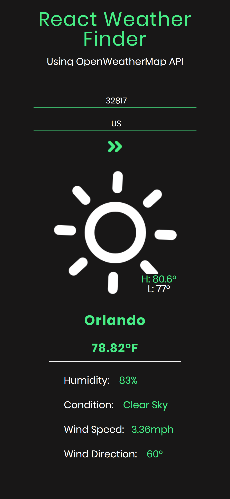

# ReactWeather
React weather webapp with OpenWeatherMap API and animated weather icons by Skycon. 

### Usage:
1. Copy to directory
2. Run npm i to install dependencies
3. Grab an API key from openweathermap and set it something like const API_KEY = yourkeyhere (not recommended, use .env instead)
4. Run npm start

### Tech stack: 
1. ReactJS
2. Npm/Yarn
3. Sass/Scss
4. Html
5. Js

### Many improvements to be made:
1. More responsiveness
2. 5Day forecast option
3. Country code should be a dropdown menu
4. Autofill fields with user location
5. Night icons past a certain time
6. Auto refresh after a certain interval

